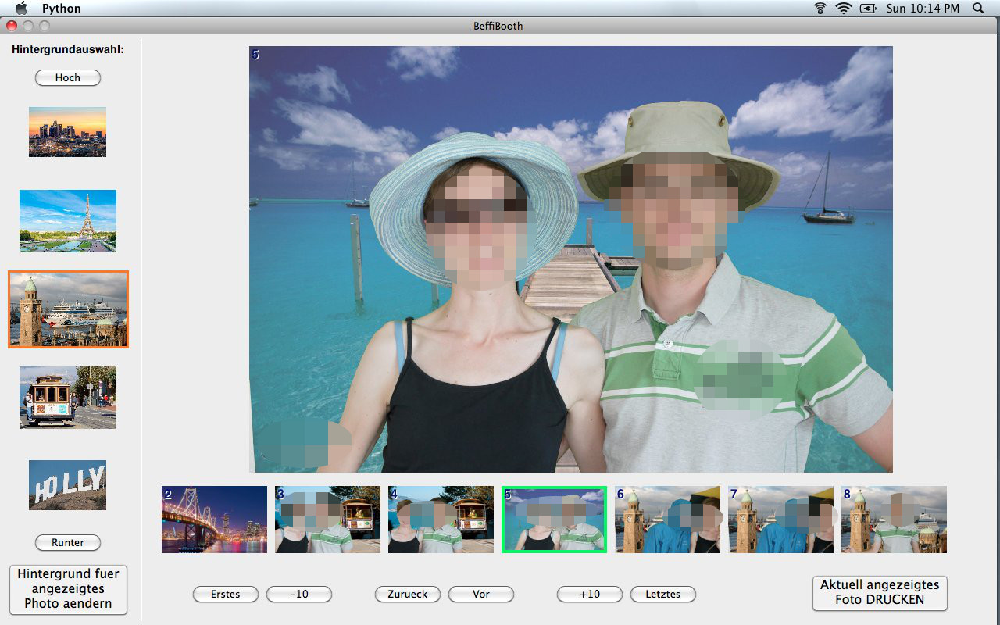
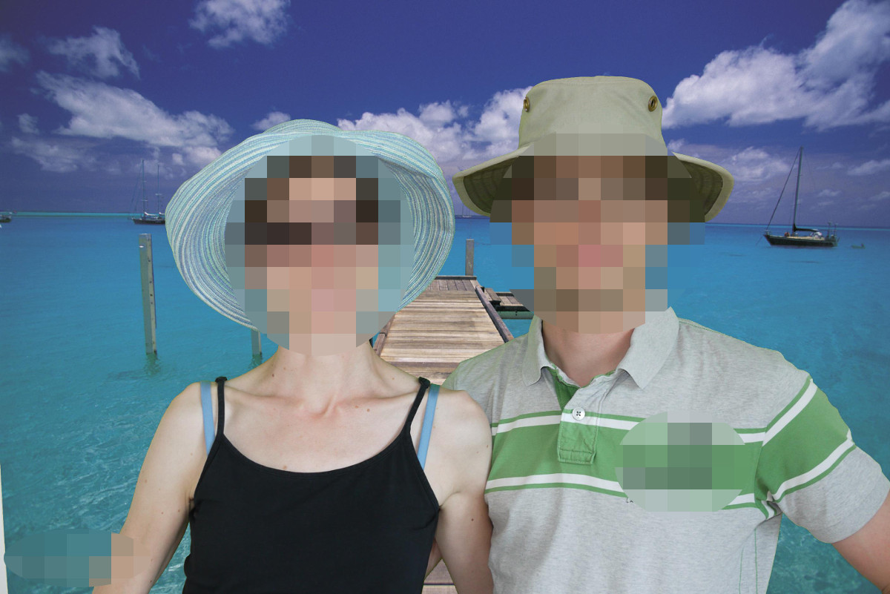
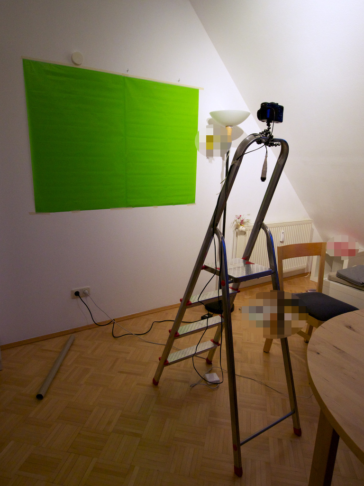

# greenie
A green-screen photo booth and GUI written in Python

This is *the* gift and activity for any wedding: You select a range
of background pictures, e.g. from the couple's past or planned travels.
Guests snap a picture of themselves in front of the green screen and select a background.
The green screen compositing 'beams' them into the background's location.
The GUI support on-site printing, so guests can add their printed picture to
a guest book and sign it.

(This was intended as a one-time project, so the code is a bit rough around the edges.)

## GUI for foreground and background selection

(GUI has English labels now.)

## Example composite image

## Example hardware setup

This setup uses a camera with a cable remote, 
green paper as green screen,
an Eye-Fi card to wirelessly transfer images to the notebook running the GUI,
and an Epson photo printer (not shown).

Note: this is the experimental setup, the final installation looked much nicer :-)

 

## Installation

* Clone the repository
* Create a new conda environment from `env.yml` (or install the listed packages in your preferred way)
* Configure paths etc. in `greenie.py`
* Run `greenie.py`
* Check errors, debug, repeat :-)

